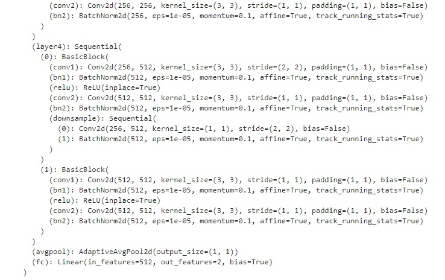
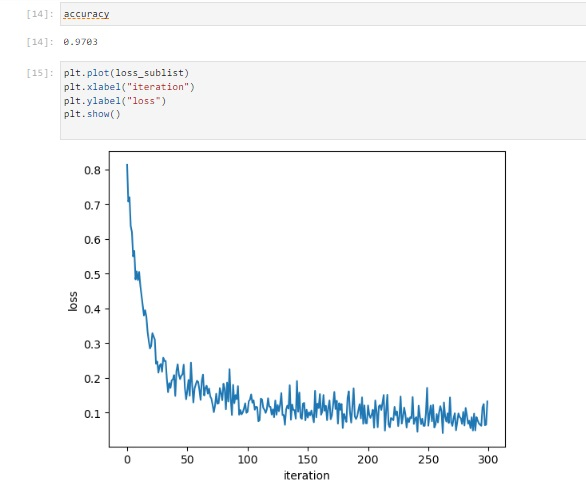
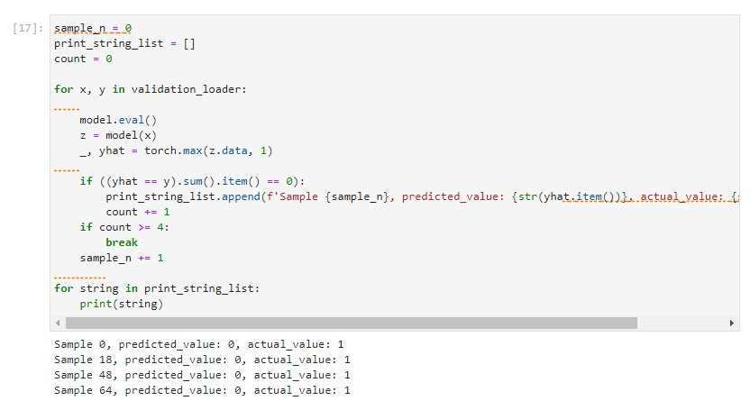

# AI Capstone Project: Concrete Crack Detection Using Deep Learning

This project is part of the **AI Capstone Project with Deep Learning**, which serves as the final project of the IBM AI Engineering Professional Certification through Coursera. In this project, I applied my knowledge in deep learning to solve a real-world challenge: detecting faults, cracks, or ruptures in concrete structures using image classification techniques.

## Project Overview

The goal of this project is to build a deep learning model capable of detecting cracks in concrete structures from images. I utilized a ResNet18 architecture, modifying the final layer to classify between two categories: **Positive** for cracked and **Negative** for not cracked.

Key elements of the project include:
- **Data Preprocessing**: Images were preprocessed and normalized for input into the neural network.
- **Model Architecture**: A pre-trained ResNet18 model was used, with the final layer adapted to a (512, 2) output for binary classification.
- **Training**: The model was trained on labeled images of concrete structures, with the goal of maximizing accuracy and minimizing loss.
- **Evaluation**: The model's performance was evaluated using standard metrics such as accuracy and loss evolution, as well as misclassified samples.

## Project Highlights

### 1. Model Architecture

The ResNet18 model was fine-tuned by replacing the last fully connected layer with a new layer `(512, 2)`, allowing for binary classification between cracked and intact concrete structures.

Example output of the modified model:

  

### 2. Accuracy and Loss

The model achieved **97.03% accuracy** during validation. Below are some visualizations of the training process:

- **Accuracy and Loss Plot**:

  

### 3. Misclassified Samples

Here are a few examples of misclassified samples, which provide insights into the challenges faced by the model when distinguishing between cracked and non-cracked images:

  

## What I Learned

Through this project, I developed and tested a deep learning model that detects structural faults in concrete. Key learnings include:
- Building and fine-tuning a deep learning model using ResNet18.
- Executing the full pipeline of data preprocessing, model training, and evaluation.
- Improving model performance by experimenting with different techniques.
- Understanding the limitations of the model through error analysis.

## Conclusion

This project demonstrates how deep learning can be applied to real-world problems, such as fault detection in critical infrastructure. The model shows promising results and could be further refined for practical deployment.
